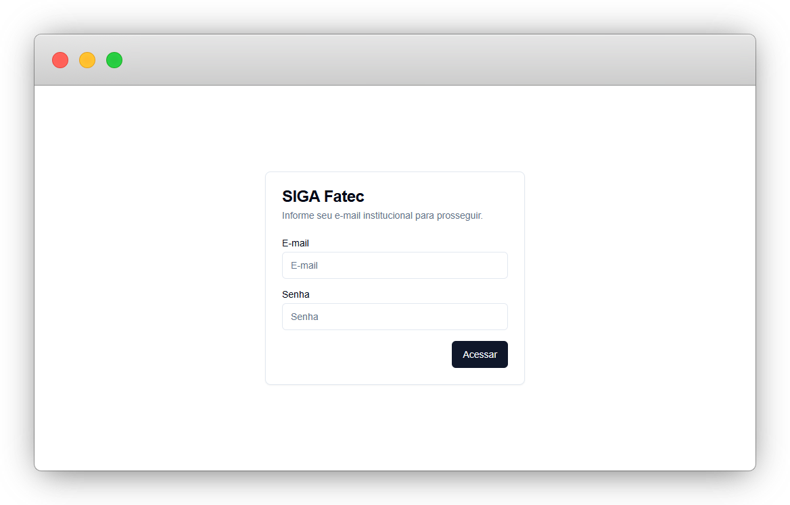
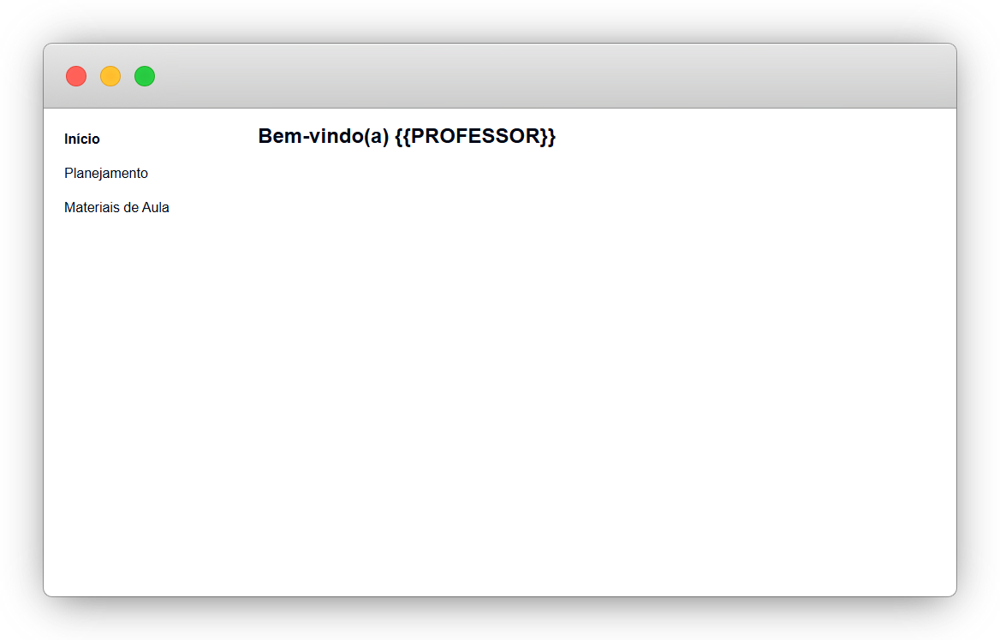
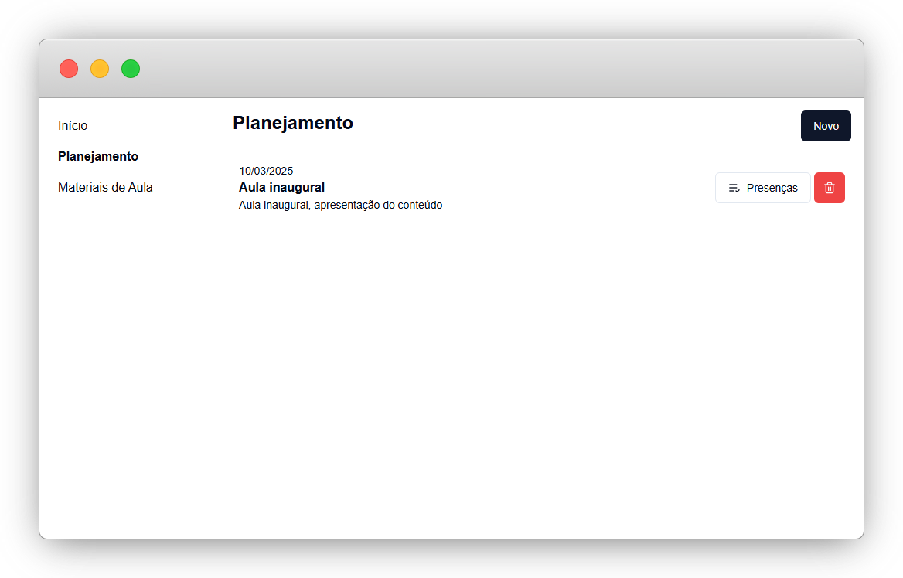
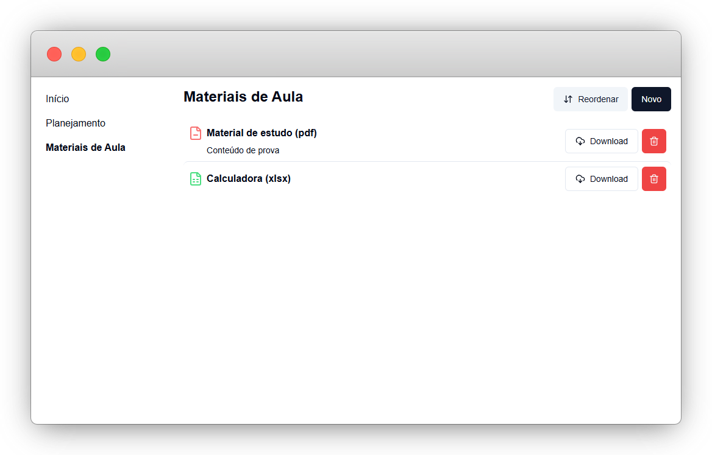

# SIGA Fatec - Sistema de Gestão Acadêmica

Este é um projeto de Trabalho de Conclusão de Curso. Apenas para fins educacionais.
O projeto trata-se de um sistema de gestão para professores de uma faculdade, neste caso, os professores da Fatec.

## Screenshots






## Instalação

#### 1️⃣ Clonando o repositório

```bash
git clone https://github.com/gabrielwbenatti/siga-fatec.git
cd siga-fatec
```

#### 2️⃣ Instalando dependências (server)

```bash
cd server
yarn
yarn prisma migrate dev
```

#### 3️⃣ Instalando dependências (siga-web)

```bash
cd siga-web
yarn
```
